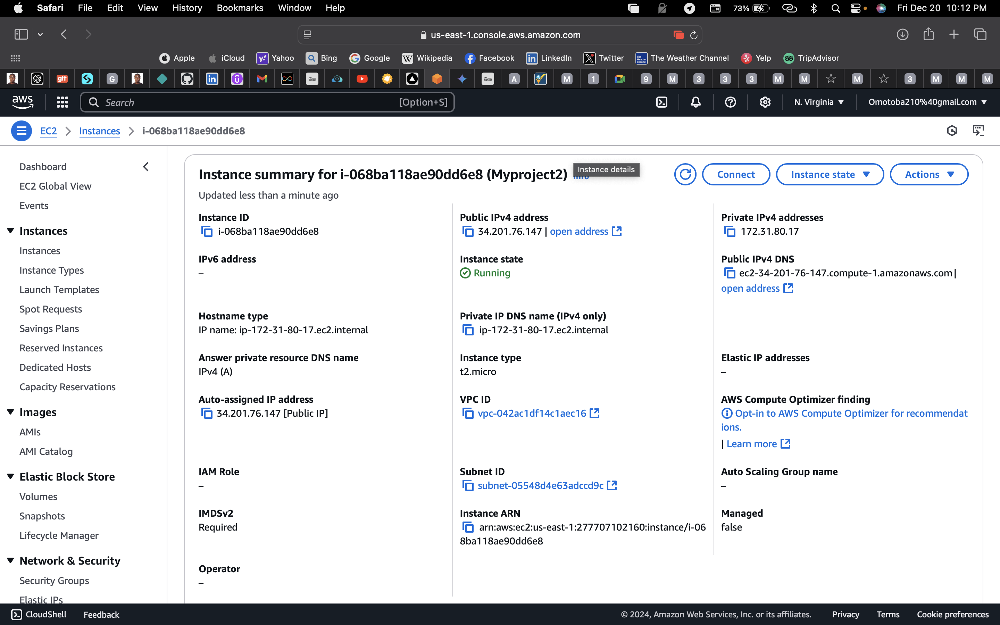
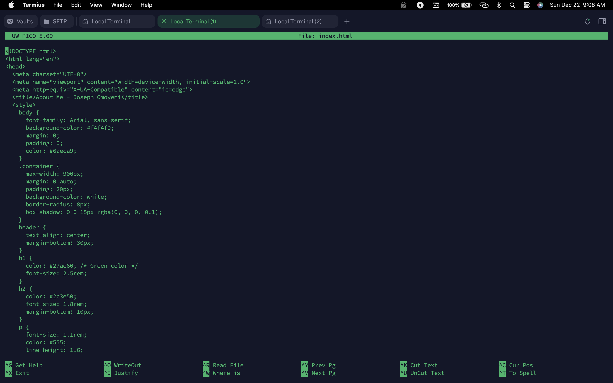
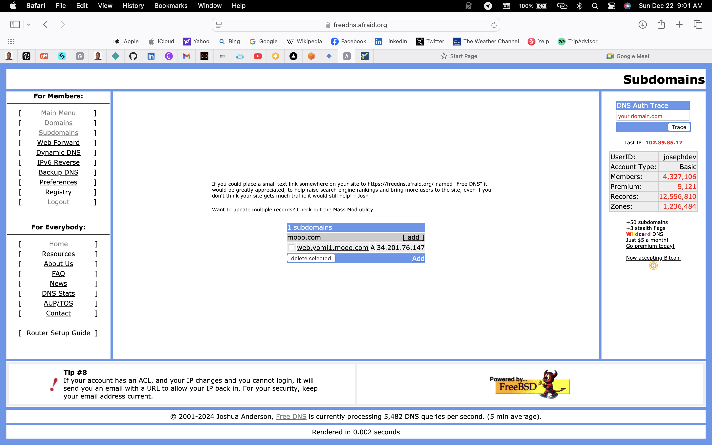

## Project Overview

This project involves deploying a *web server (Apache)* on an *AWS EC2 instance, installing the Apache web server, deploying an HTML page, and configuring networking for external access. The setup was performed using my **local terminal* instead of the EC2 instance's terminal.

## Step 1: Log in to AWS
First, I logged into my AWS Console using my ROOT user credentials.

---

## Step 2: Launch an EC2 Instance
- I launched an Ubuntu t2.micro instance.
- Created a new key pair.
- Configured the security group inbound rules to allow:
  - **Port 22** ssh from my ip
  - **Port 80** http from anywhere
  - **Port 443** https from anywhere
 
 
---

## Step 3: Connect to the Instance
Using my terminal, I connected to the instance with SSH.

1. Navigated to the folder where my downloaded key pair was saved.
2. Used this command:
  % ssh -i "Ec2 key.pem" ubuntu@ec2-34-201-76-147.compute-1.amazonaws.com

## Next is to Update and Upgrade the Instance
i was Logged in as Ubuntu user, then switched to the root user:

 %   sudo su

 %   Apt update 

Upgrade the Instance for recent versions

 %    Apt upgrade -y

## Step 5: Install Apache
Installed the Apache2 web server:

 % apt install apache2
 

 ## Step 6: Start and Enable Apache
After installing Apache2 we need to enable it and then check the status.

 %  systemctl start apache2
 %  systemctl enable apache2

 we can see our server is running and active

you can also confirm by going to your aws to copy your public ipv4 address and pasting it on a browser.

make sure you change the protocol to http else you'll get an error.

e.g  [http://https://34.201.76.147/] not (https://34.201.76.147/) 

if everything is done right you should see something like this.

## step 7:Replace Default Index.html
run the following command below.

Navigavte to the html directory
%  cd /var/www/html 

list file 
% ls  

Edit the index.html file
% nano index.html

paste the content of your own web page in this index.html file or simply delete and create your own index.html

## Step 8: Create a Domain
Registered a free domain using afraid.dns.

and configureed my public ipv4 address to my registred domain

## Step 9: Install Certbot for SSL

run the following command
%  sudo apt install certbot python3-certbot-apache -y

% sudo cerbot --apache

follow the prompt and enter email 

i

## Step 10: Verify SSL certificate

Tested to ensure SSL was correctly assigned to my domain.

After completeing the steps 

Apache was running with my  custom  index.html landing page.
SSL was successfully installed and verified.
My web server was accessible via the custom domain at https://web.yomi1.mooo.com/.

